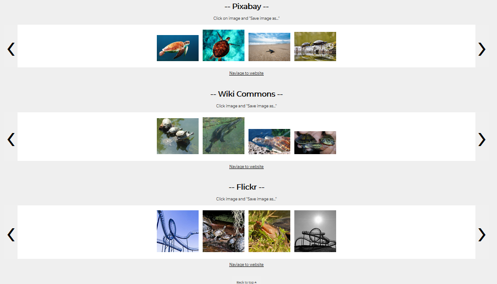

# OpenSourcePhotos

Summary: OpenSourcePhotos allows a user to search three major photo hosting websites for photos with different creative commons license attribtutions. Users are able to delegate the license attribution, scroll through the photos that are return based on the search term, and recieve curated information regarding the origin and author of the photo. Additionally, users are provided a direct download link to allow for easy usage of the image.

Technology used: HTML/CSS/JavaScript/jQuery

Live app: https://jkathan.github.io/OpenSourcePhotos/

Screenshots:
 
 

Future updates: 
- make images larger from flickr
- make flickr search more specific
- build lightbox that provides information about image
